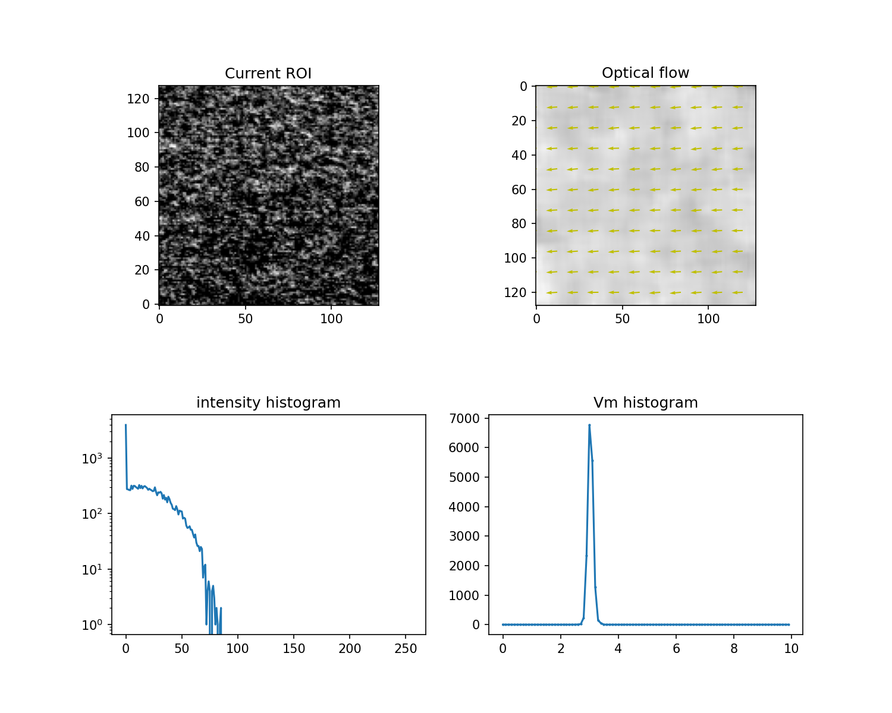
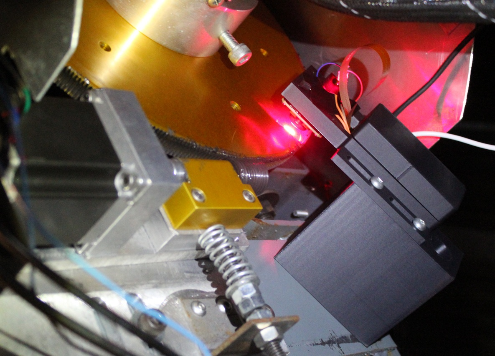

Expanded storyline: https://watchobs.com/astronomy12.html

Ultra fine 2 axis position sensing by lensless speckle imaging

Initial design and code:
Andre Germain
Watch Observatories
Dec 2024

In search of low cost sensing for camera-less guiding of an astronomical telescope as 23+ bit linear encoders are very costly, high DPI mouse were tested via NDA with PixArt and Teensy SPI coding, but the pixel size of the imager was too great for the purpose at hand.

It is also possible to use a microscope lens to discern the rough surfaces of a moving element, but speckle was tried as it does not require a lens and therefore no focusing. The speckle patterns in this setup are in the near field (rather than far field) and mean speckle size is govern by local phase curvature d ≈ √( λ · z ) where λ = wavelength (m), z = distance from scattering surface to sensor - spot size plays no part as opposed to far field. Therefore the speckle increase by the square root of the distance between the speckling surface and camera sensor.

With that in mind, 1 cm target to sensor was chosen with a red laser diode defocused and an OV9281 monochrome sensor having micro-lensed 3um square pixels. In this configuration, the mean speckle patterns are 5 pixels across. By correlating two subsequent images, the shift of the convolution peak is the deplacement between the two images. Integrating these displacements over time leads to the motion in X and Y.

In the test carried out on the Ritchey Chretien 16" telescope, a 10" gear was used to sense it movement at 4.75" of radius. The data uploaded to git shows the telescope stopped, then moving to counter the earth's rotation, or some 15.4 arc-sec per second. These are tiny movements for the sensor, yet they were cleary picked up.

